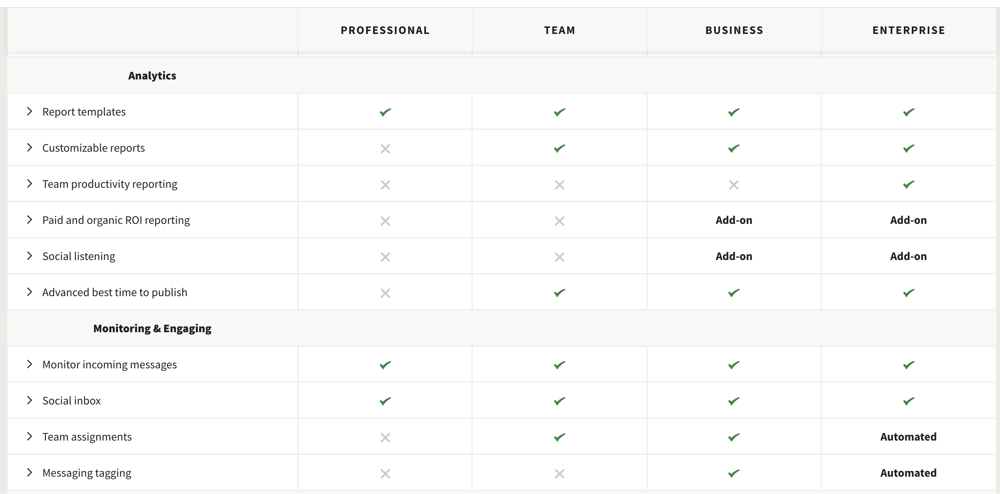
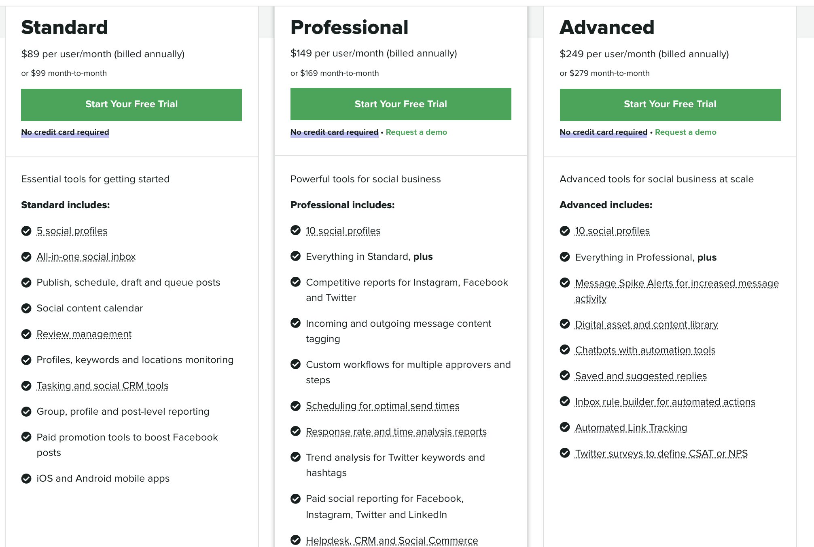
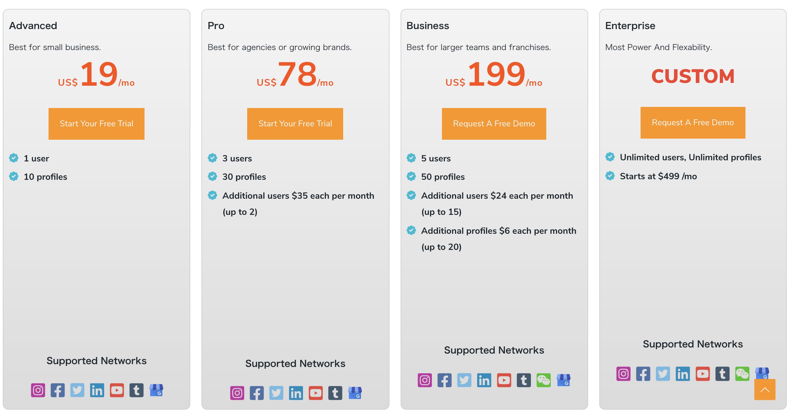
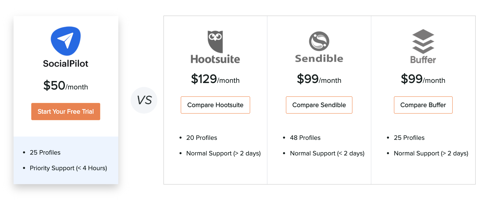
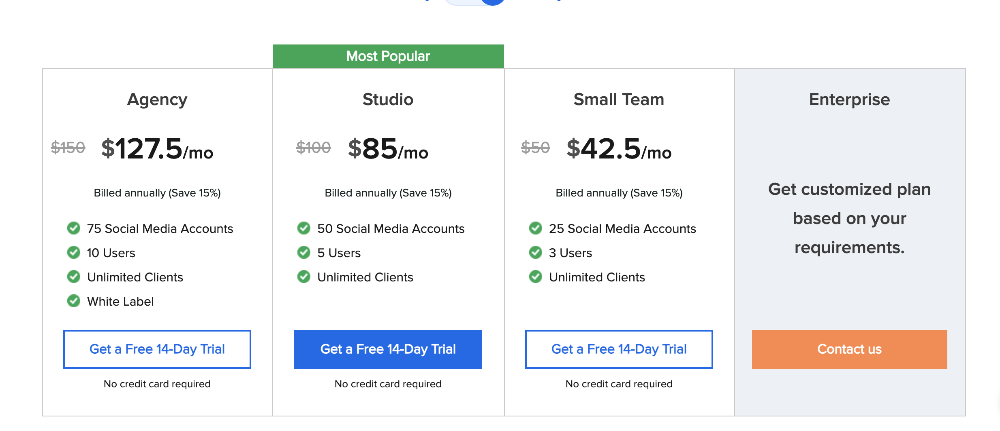
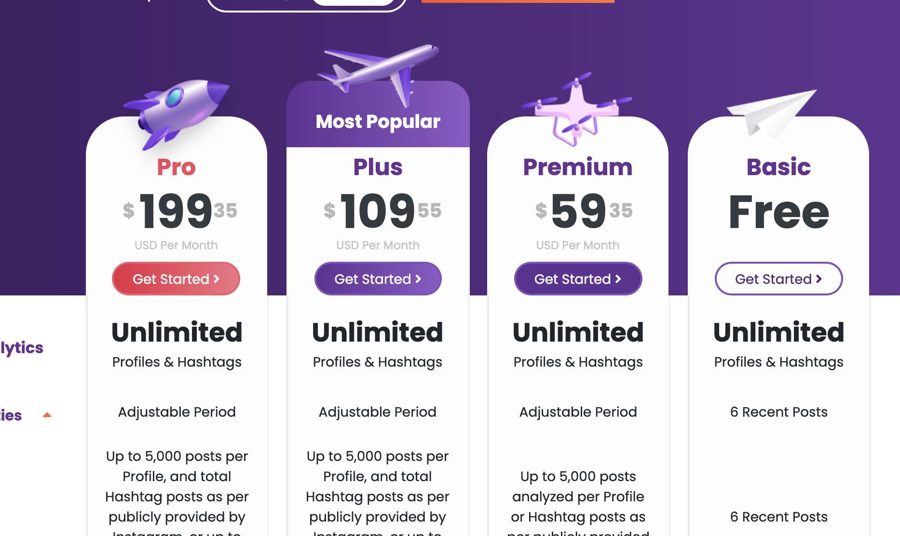
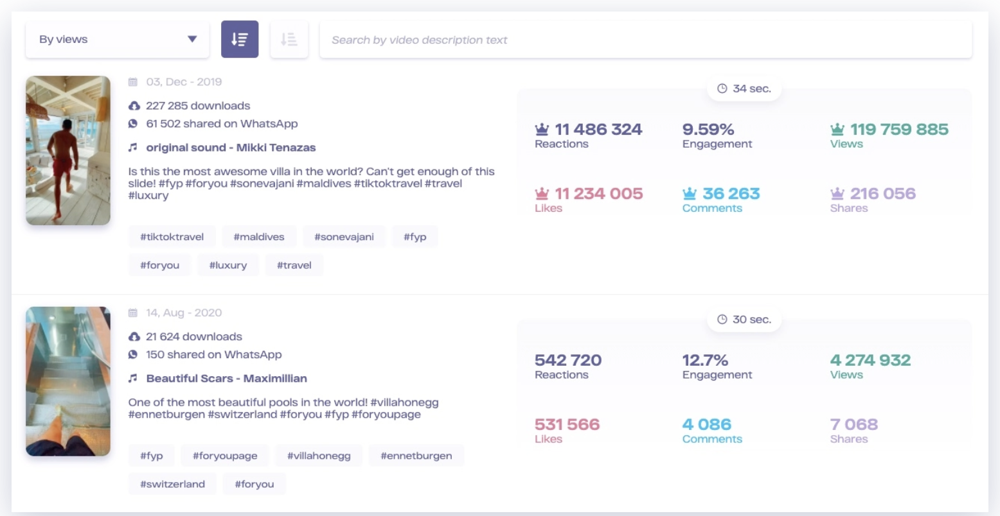

# SNS Research Report

:2022/2/4(Fri) ::Fujii Kazuki

## 基本要件

以下の SNS における、更新日時、Impression, Engagement を取得できるツールであること。

- Facebook
- Twitter
- Instagram
- YouTube
- TikTok

## 既存ツール

- [Buffer](https://buffer.com/pricing?cta=bufferSite-homepage-hero-selectAPlan-1)

  - 料金  
    $5/month, $60/year  
    人数制限などを解除するには、$10/month, $120/year
  - 対応 SNS  
    Instagram, Facebook, Twitter, LinkedIn, Pinterest
  - Performace Overview  
    Imppressions, Engagement, new followers

  - その他機能  
    Boosted Post Insights, Hashtag Performance, Easy Account Switching

- [Hootsuite](https://www.hootsuite.com/plans)

  - 料金  
    管理ユーザー 5 人, 35 　 SNS アカウント ¥66100/month
  - 対応 SNS  
    Instagram, Facebook, Twitter, Youtube, LinkedIn, Pinterest
  - Performace Overview

    > CUSTOM ANALYTICS  
    > Insights to inform your strategy
    > Define and report on the metrics that matter most to your business. Select from predefined, presentation-ready templates or create your own. From a single report you’ll see the impact of your content across all your social networks.

    デモを請求（無料）してみないと、具体的にどこまで見れるのかは不明。follower の変化等がみれることは確認済み

  - その他  
    [プラン比較](https://www.hootsuite.com/plans)
    

- [sproutsocial](https://sproutsocial.com/)
  - 料金  
    管理ユーザー 1 人, 10  SNS アカウント $149 /month
  - 対応 SNS  
    Instagram, Facebook, Twitter
  - Performace Overview  
   [プラン比較](https://sproutsocial.com/pricing/)   
   

- [MAVSOCIAL](https://mavsocial.com/pricing/)
  - 料金  
    管理ユーザー 5 人, 50  SNS アカウント $199 /month
  - 対応 SNS  
    Instagram, Facebook, Twitter, LinkedIn, YouTube, など
  - 特徴機能
    - Sentiment Analysis(=感情分析)  
      - Sort and filter by your customers’ reactions to your brand, product, or service to understand audience insight.
    - Unlimited Reports by Network
      - Analyze and export your post performance. Unlimited exporting of reports to Excel or PDF.
    - Community Management (Inbox) Reports
      - Analyze the response times by network and team members. Track the number and types of messages being received.
  - [プラン比較](https://mavsocial.com/pricing/)
  

- [SocialPilot](https://www.socialpilot.co/plans)
  - 料金  
     75  SNS アカウント $150 /month

     主要サービスの中で、コストパフォーマンスがもっともよいと自称しているサービス（真偽は、不明。カタログ上は言っていることは正しい）
     
  - 対応 SNS  
    Instagram, Facebook, Twitter,LikedInなど
  - Performace Overview  
   [プラン比較](https://www.socialpilot.co/plans)   
   

### 他のサービスを調べるにあたって
他のサービスなどと比較する際は、以下のリンクが役立つ可能性が高いです。
[For more information](https://buffer.com/library/social-media-management-tools/)

## 社内開発

既存のツールを使用せず、社内で開発するとなった場合の簡単なスケジュールを以下に示します。

### 開発手順

1. 各種 SNS(Instagram, Facebook, Twitter, Youtube, TikTok)において、それぞれどの項目が必要なのかのヒヤリング調査  
   (この際、かなり細かな聞き取りが必要。)
2. 各種 SNS の API 仕様書の読み込み作業  
   (特に TikTok の API 周りがかなり複雑怪奇な所感)
3. 無料で使える範囲内なのか、それとも有料の API を使うべきかの検討
4. 言語、使用するフレームワークの決定
5. それぞれの SNS ごとに、コーディング作業
6. 数字だけでなく、自動でグラフ等が表示されるようにする場合は、そのためのコーディング作業
7. 非エンジニアが使用できるようにするための UI の作成
8. UI の実装作業
9. テスト
10. バグ修正

エンジニアとして考えられるメリット、デメリットを列挙します。

### 社内開発のデメリット

- 開発完了までに、数ヶ月、場合によっては、半年単位での作業が必要となる。（これは求める水準による。）
- 有料の API 等の使用や、AWS の費用等が発生する。

### 社内開発のメリット

- 拡張性に優れる。  
  既存の分析ツールでは、得られない情報等も、開発チームに要望を出し、開発可能なものであれば、後から追加できる。
- 運用コスト面で、低コストになりやすい  
  一度開発してしまえば、AWS と有料 API の費用以外には、保守費用のみしか発生しない。

## TikTok について

上記のどのツールもTikTokは対応していないため、以下にTikTokの分析に関する調査報告を行う。

TikTokの分析においては、公式のTikTok Pro Accountが最善であるとの記事が散見された。
しかしながら、
> TikTok Analytics will give you the latest statistics for posts from the past 7 to 28 days. 

とあるように、日数制限が存在するようである。

非公式のツールとしては、以下が存在する。

- [MaveKite](https://mavekite.com/) free

- [analisa.io](https://analisa.io/?ref=ffmedia&tm_subid1=tiktok)
  analisa.ioは、InstagramとTikTokのみに対応しており、以下のような料金プランとなっている。
  
  [詳細情報](https://analisa.io/pricing-plan)

- [tiklog](https://tiklog.org/?ref=25e101ab)   
  $ 3.57/month (per 1 account)
  